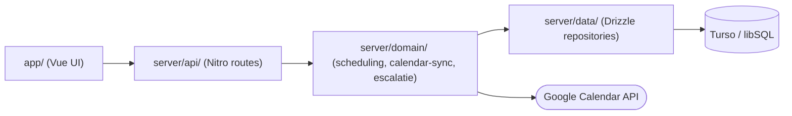
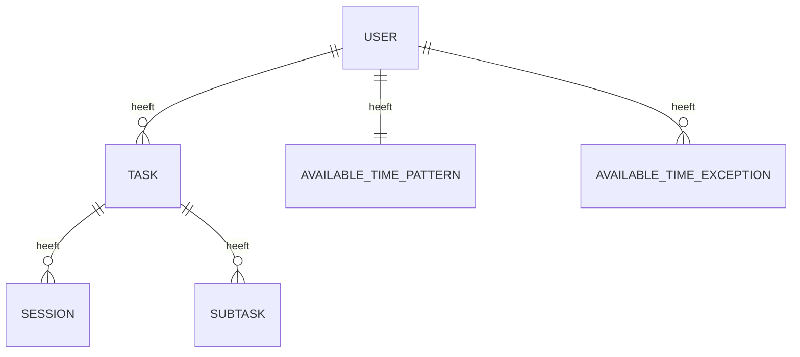
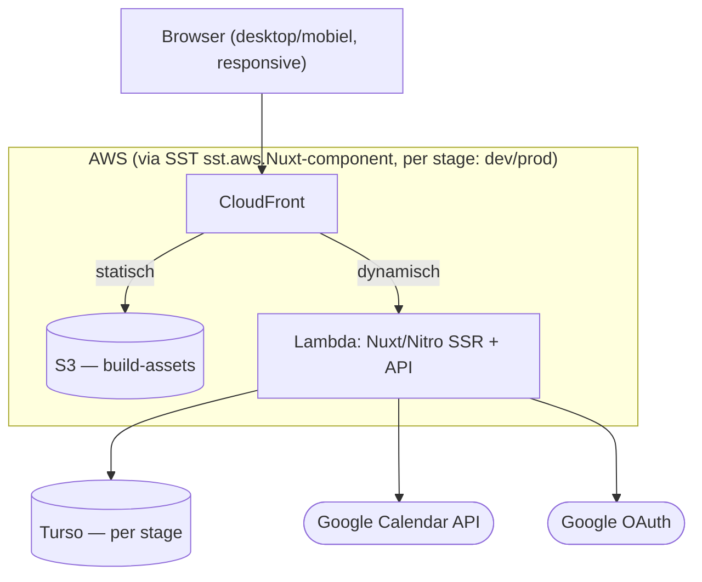

# Architecture Spine — Flowz

## Design Paradigm

Eén Nuxt 4-codebase, gedeployed als één AWS Lambda-functie (Nitro `aws-lambda`-preset, via SST). Vier lagen, elk een eigen directory, afhankelijkheid in één richting:



`app/` mag alleen `server/api/` aanroepen (via fetch), nooit `server/domain/` of `server/data/` direct. `server/domain/` mag nooit van `app/` importeren.

## Invariants & Rules

### AD-1 — Scheduling-logica is server-only

- **Binds:** UJ-1, UJ-2, UJ-6, UJ-7, UJ-8 (doelmoment/volgorde-algoritme, studiedruk)
- **Prevents:** een toekomstige tweede client (bv. losse mobiele app) die zijn eigen, afwijkende planninglogica bouwt; en dat gelijktijdige triggers (UJ-6 tijdgebrek + UJ-8 energiegebrek) tot een inconsistente planning leiden
- **Rule:** doelmoment-berekening, volgorde-algoritme en studiedruk-inschatting leven uitsluitend in `server/domain/scheduling/`. Geen enkele client — niet alleen `app/`, ook elke toekomstige client — berekent zelf een planning; alle clients tonen en vragen alleen aan. Herberekening is idempotent: omdat de planning een afgeleide weergave is (AD-3), maakt de volgorde waarin triggers binnenkomen niet uit — elke herberekening gaat uit van de actuele Task/Session/AvailableTime-staat, nooit van een tussentijds opgeslagen planningsstaat.

### AD-2 — Google-account is de enige identiteit [ADOPTED]

- **Binds:** auth, User-model, Calendar-toegang
- **Prevents:** een los wachtwoordsysteem dat later moet worden samengevoegd met Google-identiteit wanneer multi-profiel wordt opgepakt
- **Rule:** elke `User`-rij komt 1:1 overeen met een Google-account (OAuth-subject-id); er bestaat geen wachtwoordveld. Het Calendar access-/refresh-token hoort bij diezelfde `User`-rij. Het Google Cloud OAuth-consentscherm blijft in **Testing**-modus (bewuste keuze, geen Google-verificatie vooraf nodig): refresh-tokens verlopen na 7 dagen (opnieuw inloggen vereist) en gebruikers moeten handmatig als testgebruiker toegevoegd worden (cap ~100, ruim voldoende voor Evelien + zusje + vrienden).

### AD-3 — Task bezit Sessions/Subtasks; de planning is een berekende weergave

- **Binds:** UJ-1, UJ-2, UJ-4, UJ-5
- **Prevents:** een los opgeslagen "planning"-tabel die uit de pas raakt met de brontaken
- **Rule:** sessies **en deeltaken (Subtask)** zijn kind-rijen van `Task` en tellen beide mee als scheduling-input. De dag- en weekplanning (UJ-1, UJ-5) worden on-demand berekend uit Task + Session + Subtask + AvailableTime; een cache mag, maar nooit de autoritatieve bron zijn.

### AD-4 — Calendar-toegang is pull-only; geen achtergrondtaken in v1

- **Binds:** UJ-1, UJ-5, UJ-7, UJ-8
- **Prevents:** een webhook-abonnement, cron-job of proactieve achtergrond-notificatie die de huidige request-gedreven Lambda-deployment niet draait
- **Rule:** Calendar-data wordt live opgehaald op het request-pad (app-start, relevante schermweergave), nooit langer dan één request gecached, nooit via push/webhook ontvangen. Elke vorm van achtergrondverwerking (bv. proactieve push-meldingen) is expliciet uitgesteld — zie Deferred.

### AD-5 — Secrets nooit in de repo

- **Binds:** all
- **Rule:** Google OAuth client secret en Turso auth-token worden uitsluitend via SST's secrets-mechanisme gedeclareerd/gelezen; nooit als letterlijke waarde in code of config.
- **Prevents:** geheimen die per environment handmatig gekopieerd worden of in source control lekken

### AD-6 — Gebruikersgerichte meldingen zijn geen technische errors

- **Binds:** UJ-6, UJ-7, UJ-8, Ontwerpprincipe "Geen schuldgevoel"
- **Prevents:** dat een implementatie de technische `{error:{code,message}}`-envelope (Consistency Conventions) hergebruikt voor tijd-/energiegebrek-meldingen, waardoor de botte technische toon de PRD's schuldvrije formulering ondermijnt
- **Rule:** escalatie- en signaleringsberichten (UJ-6/7/8) gebruiken een apart `Notification`-shape (`{ notification: { type, message, actions } }`), nooit de technische error-envelope. De exacte formulering is UX-scope, maar de scheiding in shape is hier vastgelegd zodat een implementatie ze niet per ongeluk samenvoegt.

### AD-7 — Calendar write-sync is synchroon binnen het request-pad, geen nieuwe achtergrondverwerking [TOEGEVOEGD 2026-07-26]

- **Binds:** UJ-2, UJ-6, UJ-7, UJ-8 (elk moment waarop de scheduling-engine een sessie plant of herplant), AD-4
- **Prevents:** dat Calendar-schrijfacties alsnog een achtergrondtaak, cron-job of webhook worden — wat in strijd zou zijn met AD-4's request-gedreven Lambda-deployment
- **Rule:** indien Evelien een vaste Google Calendar-kleur voor huiswerk heeft ingesteld, schrijft Flowz geplande/herplande sessies terug als events met die kleur (`server/domain/calendar-sync/`, `POST`/`PATCH`/`DELETE` per sessie). Dit gebeurt uitsluitend **synchroon, binnen hetzelfde request** dat de (her)planning uitvoert — nooit via een aparte achtergrondtaak. AD-4's "pull-only"-regel wordt hiermee expliciet verruimd: pull-only blijft gelden voor lezen (geen webhook-abonnement op Calendar-wijzigingen), maar synchrone push binnen het request-pad is toegestaan voor schrijven. Bij een handmatige wijziging/verwijdering van het event door Evelien zelf, buiten Flowz om: geen conflict-detectie in v1 — Flowz overschrijft/hermaakt het event gewoon bij de eerstvolgende (her)planning (Flowz is bron van waarheid voor zijn eigen events, niet voor Evelien's overige agenda-items).
- **Herkomst:** ontstaan tijdens de UX-fase (Phase 4, `design-artifacts/C-UX-Scenarios/04.../4.1-...` en `08.../8.1-...`) als oplossing voor valse agendaconflict-meldingen — geen PRD-eis, wel productbeslissing van Hillebrand, bekrachtigd via `bmad-check-implementation-readiness` op 2026-07-26.

## Consistency Conventions

| Concern | Convention |
| --- | --- |
| Naming (entities, files) | `Task`, `Session`, `Subtask`, `AvailableTimePattern`, `AvailableTimeException`, `User`. PRD-termen (`studiedruk`, `doelmoment`) blijven ongewijzigd als code-namen, zodat PRD en code herleidbaar blijven. |
| Data & formats | Datums/tijden ISO 8601 UTC in de data-laag; duur altijd in minuten (integer) — ook de werkelijk bestede sessietijd wordt bij afronden afgerond op minuten opgeslagen, niet als los start-/eindtijdstempel-paar; ids zijn door Drizzle gegenereerde UUID's. |
| State & cross-cutting | Elke mutatie op Task/Session/Subtask loopt via `server/domain/`-services — nooit directe DB-writes vanuit `server/api/`-handlers. `Session` heeft gescheiden schrijfpaden voor geplande velden (door de scheduler, `server/domain/scheduling/`) en werkelijke velden (door de sessie-runner tijdens UJ-1); geen van beide overschrijft het domein van de ander. `AvailableTimeException` heeft één schrijfpad (het UJ-3-scherm), ongeacht of de waarde handmatig ingevuld is of via UJ-7 voorgevuld. Auth via Google OAuth-sessiecookie, gevalideerd in Nitro-middleware. Technische errors als vaste envelope: `{ error: { code, message } }`, met een gedeelde error-code-vocabulaire in `server/domain/errors.ts` (geen endpoint verzint een eigen `code`). Gebruikersgerichte meldingen (UJ-6/7/8) volgen in plaats daarvan AD-6's `Notification`-shape. |

## Stack

| Name | Version |
| --- | --- |
| Nuxt | 4.x |
| Nitro preset | aws-lambda (`inlineDynamicImports: true` voor cold-start-optimalisatie) |
| Vue | 3.x |
| Node | 24.x (Active LTS op AWS Lambda sinds nov. 2025 — geverifieerd juli 2026) |
| Drizzle ORM | laatste stabiele (libSQL-driver); migraties via `drizzle-kit generate` + `migrate`, niet `push` (bekende table-recreation-bug tegen libSQL) |
| Turso Cloud (libSQL-backed) | laatste stabiele client — expliciet niet de losstaande "Turso Database" bèta (Rust-rewrite) |
| SST | v3/Ion (laatste stabiele; officiële Nuxt-component) |
| Google Calendar API | v3 (OAuth 2.0) |

## Structural Seed

```text
flowz/
  app/              # Vue UI: hoofdscherm, sessie, taak-formulier, weekoverzicht
  server/
    api/            # Nitro HTTP routes — dun, valideert en delegeert
    domain/
      tasks/        # Task/Session/Subtask CRUD + mutatie-ownership
      scheduling/    # scheduling engine, escalatielogica (UJ-6/7/8)
      calendar-sync/ # Google Calendar pull + conflict-detectie (UJ-7); synchrone write-sync van huiswerk-events (AD-7)
    data/           # Drizzle schema + repositories (Turso)
  sst.config.ts     # infra-as-code: Lambda, stages, secrets
```





SST's `sst.aws.Nuxt`-component zet deze driedeling (S3 + CloudFront + Lambda) automatisch neer — geen losse configuratie. Let op: CloudFront hanteert een **standaard requesttimeout van 60s** (Lambda zelf staat tot 900s toe); bij Flowz' schaal van scheduling-berekeningen wordt dat niet verwacht een probleem te zijn, maar een limietverhoging bij AWS is nodig mocht dat ooit wél zo zijn.

## Capability → Architecture Map

| Capability / UJ | Lives in | Governed by |
| --- | --- | --- |
| UJ-1 werksessie | `app/` sessiescherm + `server/domain/scheduling` (voortgang) | AD-1, AD-3 |
| UJ-2 taak aanmaken | `app/` formulier + `server/api/tasks` + `server/domain/tasks` (CRUD) + `server/domain/scheduling` (initiële plaatsing) | AD-1, AD-3, AD-7 |
| UJ-3 beschikbare tijd | `server/data` AvailableTimePattern/Exception | AD-3 |
| UJ-4 takenoverzicht | `app/` + `server/api/tasks` + `server/domain/tasks` (CRUD) | AD-3 |
| UJ-5 weekplanning | `server/domain/scheduling` (read, incl. knelpunt-signalering) + Calendar pull | AD-3, AD-4 |
| UJ-6 tijdgebrek | `server/domain/scheduling` escalatieketen | AD-1, AD-7 |
| UJ-7 agendaconflict bij opstarten | `server/domain/calendar-sync` + escalatieketen | AD-1, AD-4, AD-7 |
| UJ-8 dag niet volgens plan | `server/domain/scheduling` escalatie (tijd/energie) | AD-1, AD-7 |
| Auth + Calendar-toegang | `server/api/auth` (Google OAuth) | AD-2, AD-5 |

**UX-randvoorwaarde zonder architectuur-impact:** "Rustig hoofdscherm" (Ontwerpprincipes) is een puur visueel/UX-gestuurde eis op `app/`'s hoofdscherm-component — geen data- of API-consequentie, dus geen eigen AD. Genoteerd hier voor traceerbaarheid naar de UX-fase.

## Deferred

- **Meerdere gebruikersprofielen** — `User` is al 1:1 aan een Google-account gekoppeld (AD-2), dus een extra profiel = een extra `User`-rij zonder schema-herontwerp. UI voor profiel-switchen/uitnodigen is niet ontworpen.
- **Multi-device sync** — inherent aanwezig (Turso is dé bron, bereikbaar vanaf elk apparaat via dezelfde API); apparaat-specifieke UX (bv. "laatst bewerkt op ...") is niet ontworpen.
- **Spraak-naar-tekst taakinvoer** — verwacht een pure `app/`-toevoeging (invoerveld), geen impact op `server/domain/` of `server/data/`.
- **Adaptieve tijdschattingen ("leert van jou")** — voegt een nieuwe domain-concern toe (leer-/schattingsmodel) bovenop AD-1's scheduling-engine; geen schema hiervoor gereserveerd.
- **Magister API / Microsoft SSO** — zou een tweede identiteits-/importbron naast AD-2 introduceren. Reëel toekomstig conflictpunt: bij oppakken moet expliciet gekozen worden tussen AD-2 uitbreiden of een aparte, auth-loze importstroom.
- **Specifieke aanpak voor uitstelgedrag** — bewust uitgesteld per PRD, geen architectuur-impact verwacht.
- **Achtergrondtaken/push-notificaties** — v1 is volledig request-gedreven (AD-4); proactieve meldingen (bv. "je hebt nog niets gedaan vandaag") zouden een achtergrondproces vereisen dat de huidige Lambda-deployment niet heeft. Uitgesteld tot er een concrete use-case is.
- **Observability/logging** — geen aangepaste logging-/monitoringstrategie; Lambda's standaard CloudWatch-logs volstaan op hobby-schaal. Herzien zodra foutopsporing dat vereist.
- **Backups/dataverlies** — geen eigen backup-pipeline; Turso's ingebouwde back-up/point-in-time-recovery is de aanwezige vangnet. Herzien als dit ontoereikend blijkt.
- **Lambda cold-start vs. "binnen enkele seconden"-eis (PRD Doel van v1)** — reëel risico, geen non-issue: Node P50 cold start ligt rond 200-400ms, maar P95 rond 1,2-2,8s (een Nuxt/Nitro SSR-bundel is zwaarder dan een minimale functie, dus eerder de bovenkant van die range). Bij Eveliens sporadische gebruikspatroon (Lambda recyclet na ~5-15 min inactiviteit) raakt een flink deel van de app-opens waarschijnlijk een koude start. Bewust nu geaccepteerd zonder mitigatie; als dit in de praktijk hinderlijk blijkt, eerst een goedkope EventBridge-keep-warm-ping overwegen (kleine, expliciete uitzondering op AD-4) vóór provisioned concurrency (ondermijnt de bijna-€0-idle-reden achter de Lambda-keuze).
- **libSQL-native-binaries + Lambda-bundling** — `@libsql/client`'s platform-specifieke binaries (bv. `@libsql/linux-x64-gnu`) zijn bekend om door Rollup/esbuild-bundling verwijderd te worden, met een runtime-"Cannot find module"-fout tot gevolg. Controleren bij de eerste deploy; zo nodig expliciet als Nitro-external configureren.
- **CI/CD-pipeline, teststrategie** — niet in deze run besloten; hoort bij `bmad-create-epics-and-stories`/dev-fase.
