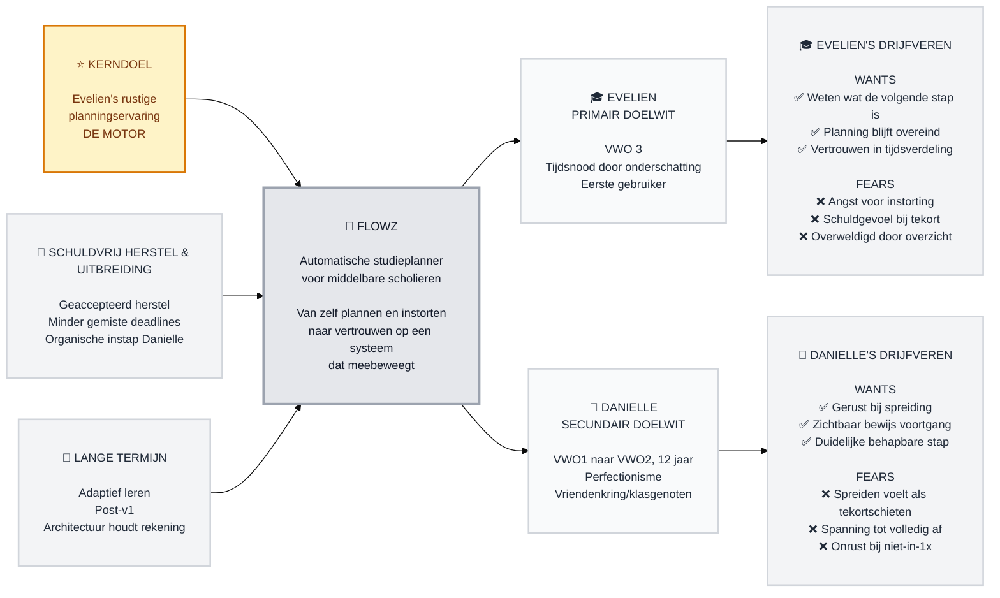

# Trigger Map: Flowz

> Visueel overzicht dat businessdoelen verbindt met de psychologie van de gebruiker

**Gemaakt:** 2026-07-20
**Auteur:** Hillebrand
**Methodologie:** Gebaseerd op Effect Mapping (Balic & Domingues), aangepast voor het WDS-framework

---

## Strategische Documenten

Dit is het visuele overzicht. Voor gedetailleerde documentatie, zie:

- **[01-Business-Goals.md](01-Business-Goals.md)** — Volledige visie en objectives
- **[02-Evelien-de-Scholier.md](02-Evelien-de-Scholier.md)** — Primaire persona, volledige drijfveren
- **[03-Danielle-de-Perfectionist.md](03-Danielle-de-Perfectionist.md)** — Secundaire persona, volledige drijfveren
- **[05-Key-Insights.md](05-Key-Insights.md)** — Strategische implicaties voor ontwerp
- **[feature-impact-analysis.md](feature-impact-analysis.md)** — Featureprioritering (Must Have / Consider)

---

## Visie

**Flowz neemt de mentale last van plannen weg bij middelbare scholieren door zelf te plannen in plaats van dat aan de leerling over te laten — en wordt daarin treffender naarmate het langer gebruikt wordt.**

---

## De Motor: Hoe Alles Samenhangt

**⭐ HET KERNDOEL — Evelien's rustige planningservaring**
Dit is het enige doel dat zelfstandig waarde heeft. Alles hieronder bestaat bij de gratie hiervan.

**🚀 SCHULDVRIJ HERSTEL & ORGANISCHE UITBREIDING** *(gedreven door het kerndoel)*
Pas relevant zodra de basis werkt: schuldvrij herstel bij tegenvallers, minder gemiste deadlines, en Danielle's organische instap.

**🌟 LANGE TERMIJN — Adaptief leren** *(post-v1, architectuur houdt er nu al rekening mee)*
Flowz' kern-differentiator uit de brief — nog niet gebouwd, maar de architectuur mag er geen drempel voor opwerpen.

---

## Trigger Map Visualisatie

---

## Hoe Te Lezen

**Links naar rechts:** businessdoelen → Flowz (het platform) → doelgroepen → hun drijfveren.

**Van boven naar beneden:** prioriteit. Het kerndoel (goud gemarkeerd) staat bovenaan omdat alle andere doelen ervan afhangen.

**✅ / ❌:** groene vinkjes zijn wat een persona wíl bereiken; kruisjes zijn wat ze wíl vermijden. Negatieve drijfveren wegen vaak zwaarder dan positieve (loss aversion).

---

## Business Strategie

**Kerndoel:** Evelien opent Flowz op elk moment en weet zonder actie te ondernemen wat de eerstvolgende stap is — dit draagt letterlijk alle andere doelen.

**Schuldvrij herstel & uitbreiding:** een tegenvallende dag leidt tot een geaccepteerd nieuw plan; Danielle stapt organisch in zodra Evelien's ervaring bewezen stabiel is.

**Lange termijn:** adaptief leren blijft de kern-differentiator uit de brief, bewust nog niet gebouwd — de architectuur houdt er nu al rekening mee.

→ Volledige details: [01-Business-Goals.md](01-Business-Goals.md)

---

## Doelgroepen

### 🎓 Evelien (Primair)
VWO 3-scholiere, eerste gebruiker. Kernpijn: taken blijken dichter bij de deadline lastiger/tijdrovender dan gedacht → tijdsnood.

**Topdrijfveren:** geen overweldigend overzicht, geen schuldgevoel bij een tegenvaller, vertrouwen dat de planning overeind blijft.

→ Volledig profiel: [02-Evelien-de-Scholier.md](02-Evelien-de-Scholier.md)

### 🧩 Danielle (Secundair)
Zusje + vriendenkring/klasgenoten, VWO1→2, 12 jaar. Kernpijn: perfectionisme — huiswerk voelt na opgave alsof het in één keer af moet.

**Topdrijfveren:** rust bij gespreide sessies, zichtbaar bewijs van voldoende voortgang.

→ Volledig profiel: [03-Danielle-de-Perfectionist.md](03-Danielle-de-Perfectionist.md)

---

## Strategische Implicaties

- De drie topscorende features (werksessie-flow, taak-formulier, automatische tijdsverdeling) vormen de kernlus en de logische ontwerpvolgorde
- Danielle wordt grotendeels "gratis" bediend door dezelfde Evelien-gerichte features
- Twee ontwerpprincipes uit de PRD (geen schuldgevoel, rustig hoofdscherm) blijven nog UX-eigendom zonder concrete uitwerking — directe input voor Phase 3/4

→ Volledige analyse: [05-Key-Insights.md](05-Key-Insights.md)

---

## Documenten

| # | Document | Doel | Status |
|---|----------|------|--------|
| 01 | Business Goals | Visie, objectives, prioritering | ✅ Compleet |
| 02 | Evelien de Scholier | Primaire persona | ✅ Compleet |
| 03 | Danielle de Perfectionist | Secundaire persona | ✅ Compleet |
| 05 | Key Insights | Strategische implicaties | ✅ Compleet |
| — | Feature Impact Analysis | Featureprioritering | ✅ Compleet |

---

_Gemaakt met Whiteport Design Studio (WDS) methodologie_
_Trigger Mapping-methodologie: Effect Mapping door Mijo Balic & Ingrid Domingues (inUse), aangepast met negatieve drijfveren_
